In this post I want to share my journey scaling up the training throughput of GPT-2 124M from 650 tokens per second (TPS) on my laptop to training on a full node of 8xH100s at 3 million TPS, and then using this knowledge to replicate the original GPT2 paper by training a full size GPT2 1.5B parameter model on 10B tokens.

Note, this post is not a tutorial on how to implement and train a GPT2 model - there are many great resources on that topic already [^1] - rather it is more of a research journal, where I layer on the various improvements out there for scaling up the training of transformer models and provide details (and graphs) on the impact these various changes have on training throughput. I expect it might interest anyone who is curios about questions like, "how much does using a H100 speed things up over my gaming GPU?", or "how big an impact do low-level algorithm improvements make in the training speed of LLMs"? If those kinds of questions tickle your fancy, then read on my friend.

> **Note:** All code is available on [github](https://github.com/Jjschwartz/gollem)

## 1. Why GPT2?

Why GPT2, it's kinda outdated isn't it? Well yes, but also the recipe for training LLMs has not changed that much since the GPT2. Furthermore, training GPT2 has a number of benefits. Firstly, there are a bunch of excellent tutorials covering implementing and training GPT2 [^1]. Secondly, with sizes ranging from 124M to 1.5B it offers a nice progression from a size I can run on my laptop up to size that really starts benefitting from industrial grade GPUs designed for AI workloads. Thirdly, the amount of data used to train GPT2 1.5B is quite modest at around 40B tokens, which can fit on any reasonable size machine (compared to the 10s of trillions of tokens for more recent models). And finally, it's the OG model that really put scaling on the map.

For those unfamiliar, here is a brief summary of GPT2 from one it's descendants, Claude: "GPT2 is an autoregressive transformer language model that predicts the next token based on previous context. It follows the standard transformer decoder architecture with multi-head attention mechanisms and feed-forward networks. While its architecture may seem simple by today's standards, the core components remain largely unchanged in modern LLMs." Thanks Claude.

To be more precise, here are some technical specs for the different members of the GPT2 family:

| Model        | Parameters | n_layers | d_model | n_heads | d_mlp | Context Size | Vocab Size |
| ------------ | ---------- | -------- | ------- | ------- | ----- | ------------ | ---------- |
| GPT-2 Small  | 124M       | 12       | 768     | 12      | 3072  | 1024         | 50,257     |
| GPT-2 Medium | 350M       | 24       | 1024    | 16      | 4096  | 1024         | 50,257     |
| GPT-2 Large  | 774M       | 36       | 1280    | 20      | 5120  | 1024         | 50,257     |
| GPT-2 XL     | 1.5B       | 48       | 1600    | 25      | 6400  | 1024         | 50,257     |

## 2. Training my first GPT2

Before jump straight into train the largest GPT2 model on 40B tokens, it seems prudent to to make sure we can train a small model on a small dataset. So here we start with GPT-2 Small (124M) on the tiny Shakespeare dataset of around 300K tokens.

For this run I wanted to see if we could get a relatively small language model to learn something (in this case shakespearian prose) under the base conditions.

For methodology, I implemented GPT2 using python and pytorch primarily following some of Andrej Karpathy's tutorials (NanoGPT and llm.c). Then for the training setup:

- **Hardware:** my Mac book M3 laptop using the CPU (i.e. `device=cpu` in torch)  
- **Hyperparameters:**
    - 1000 iterations
    - batch size = 1
    - sequence length = 1024 (i.e. full sequence length)

That's it, no additional optimizations.

So how did it go? Pretty well I think. Firstly the training loss went down:

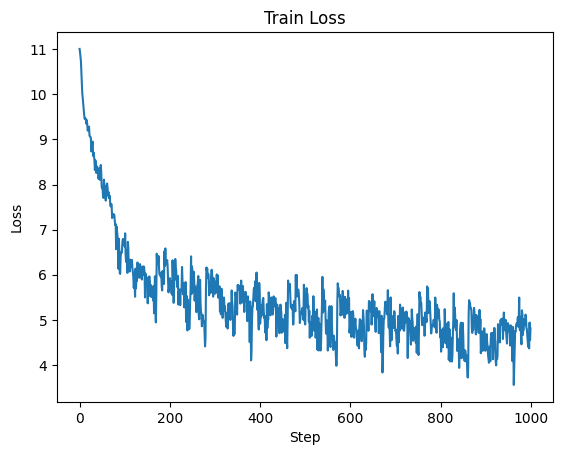

And comparing generations throughout training we can observe a clear improvement in legibility, although even after 1000 iterations it's still not amazing:

```txt
>>>Sample at step 0: 
ria courage163163163 Dougpsons impart harbour Snyderophonflation define HawTagTagMobileworks lust interested unintetermin Kremlin Latinos Ragefire Schemeの�cedovan arenas drains

>>>Sample at step 500: 
FLpherd, to the
That then I might;
Where I am the king;
Where
My lady is the
The
To hold the son

>>>Sample at step 1000: 
DUARET
I haveABYORK: 
But then then, 
Hath you do a father-cear of these to be gone to
```

Interestingly, we can see the model reproducing the "Character: text" pattern in the step 1000 output, albeit not perfectly. It also learns a liberal use of newlines, which tracks with the training data layout. With some selective prompting it's possible to get some somewhat coherent outputs. Here I prompted the model with the input "Romeo and Juliet":

```txt
Romeo and Juliet 
What fear! We are thou know me, my death. for thou woe, and so be but if thou shaltst never fly and talk Pray!<|endoftext|>
```

In total the model was trained on roughly 1M tokens (`1024 batch size * 1000 steps = 1024000`) with the model seeing each token in the dataset around 3 times. Overall it took around 26 min to train at an average of 645 tokens per second (TPS).

So it took us 26 minutes to train a 124M parameter model on 1M tokens. Scaling this up to the full size GPT2 which has 1.5B parameters and is trained on 10B tokens (the paper is 40B but lets keep the math simple), we have a 1 OOM increase in model parameters and 4 OOM increase in data. Even if we keep the model size the same and just scale up the data, training GPT2 124M would take $26 \text{ minutes} \times 10^4 = 260,000 \text{ minutes}$ or around 180 days. If we additionally scaled up the model parameters, assuming a naive 1 OOM decrease in tokens per second, this balloons to 1800 days. Ain't nobody got time for that, and that's assuming a 1.5B parameter model can even fit in memory on my laptop while training.

## 3. Scoreboard with Baseline

But before moving on, I'm going to introduce the scoreboard for tracking how training throughput changes as we layer on each improvement. Each row will be a new piece of hardware, software optimization, or some other change in our training setup. The "TPS" columns shows absolute throughput, while the "Speedup" column is the speedup over the baseline.

| Setup                            | TPS | Speedup (X) |
| -------------------------------- | --- | ----------- |
| Baseline (CPU, no optimizations) | 645 | 1.0         |

For now our scoreboard only has the baseline entry. Fortunately, there are a bunch of optimizations we can do, starting with probably the biggest: hardware!

## 4. Hardware Optimizations

AI is a big deal and lots of smart people have invested a bunch of time improving hardware for AI training workloads. I am fortunate to have access to a few of these through my work's compute clusters, which my employer [Imbue](https://imbue.com/) graciously allowed me to use for this project during times it was not in use.

### 4.1 MPS on M3

To start, I have a macbook with an M3 chip which aims to improved AI workloads. To make use of this the nice people at Apple created something they call [Metal Performance Shaders (MPS)](https://developer.apple.com/metal/pytorch/) which from my understanding is a library of deep learning specific kernels for apple hardware like the M3 chip. This is similar to CUDA for Nvidia GPUs and the best part, using MPS is as simple as changing `device=cpu` to `device=mps` in your training code.

**Results**
Training with MPS on the same laptop we get a 2x improvement in speed, going from 645 to **1499 TPS**, dropping the training time to around 12 min.

### 4.2 CUDA on Nvidia RTX 3090 GPU

Next I tried the same training setup using CUDA on an RTX 3090, a decent GPU but by no means top of the line when it comes to AI training workloads. This is a little more effort as it requires running my code on a different machine and dealing with properly installing Nvidia drivers and CUDA. But other than that nothing in my code needs to change apart from `device=cuda`.

**Results**
Even with a GPU not targeted specifically for AI workloads, the speed up is huge, coming in at a whopping **11381 TPS**, on the order of 1 OOM speedup over training on a cpu and even MPS. This dropped the training time down to around 1.5 min for 1M tokens.

### 4.3 The big one, CUDA on Nvidia H100 GPU

Finally I tried the industry workhorse GPU for LLM training: the H100. As expected we see another big boost with TPS increasing up to **27,026** tokens, dropping the time to process 1M tokens down to 35-40 s. Now we are talking.

### 4.4 All together now

Now we can do a side-by-side comparison of speed based on hardware. Firstly, let's look at the speedup in tokens per second with respect to using a `cpu`:

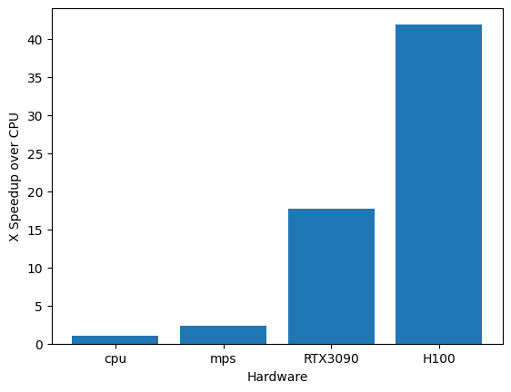

Not unexpectedly we see over 1 OOM speedup when switching to using a GPU, with around a 42X speedup when using the H100 over the CPU baseline.

We can see this speedup expressed in training loss. Here we look at the training loss by time for each hardware setup:

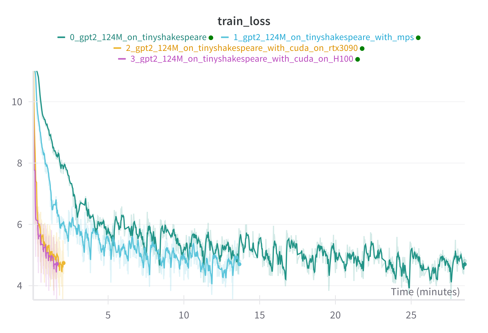

And just as a sanity check to make sure we are getting the same final model performance for each setup, we can observe that the training loss per step is almost exactly the same for each setup:

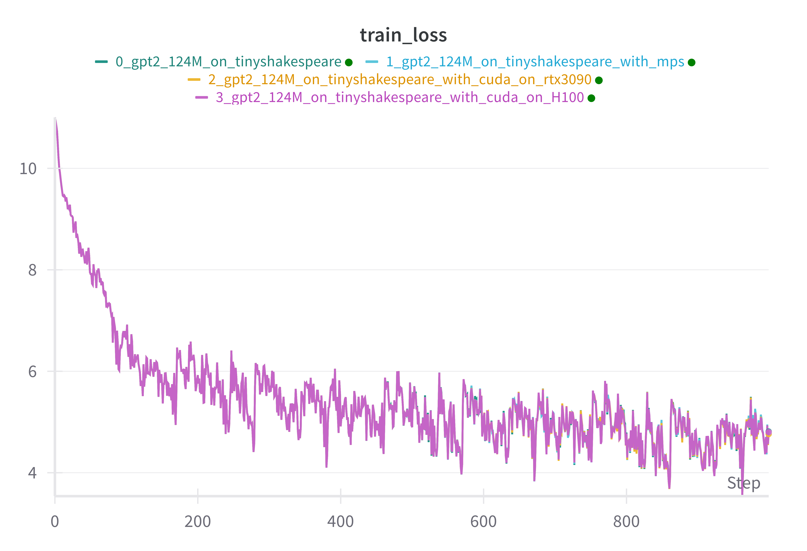

Very neat!

So big GPU make training go fast. Nothing too surprising there, except maybe the ease of doing it (says the person who didn't have to install the GPUs in the data center).

But even at 27K tokens per second, that would still require around 4 days to train a 124M param model on 10B tokens and around 40 days for a 1.5B param model (using our naive 1 OOM slowdown). Still far from desirable if we are to train something with 3-7B params on even more tokens. Fortunately there are still many optimizations we can make!

## 5. Scoreboard after hardware optimizations

An here we have our scoreboard so far, after adding rows for each hardware setup we used.

| Setup                            | TPS       | Speedup (X) |
| -------------------------------- | --------- | ----------- |
| Baseline (CPU, no optimizations) | 645       | 1.0         |
| Hardware: MPS                    | 1149      | 1.78        |
| Hardware: CUDA on RTX 3090       | 11381     | 17.64       |
| **Hardware: CUDA on H100**       | **27026** | **41.90**   |

## 6. Side quest: Model FLOP Utilization (MFU)

Before moving on to software optimizations, it would be good to have a way to measure how effectively we are using the hardware we have at our disposal.

Model FLOP Utilization (MFU) is a widely used metric for measuring how efficiently your training setup is using the theoretical capacity of your hardware. It's also fairly simple to calculate:

$$
MFU = \frac{CD}{P}
$$
Where:

- $C$ is the model's FLOPs per token
- $D$ is the observed tokens per second
- $P$ is the theoretical peak FLOPS of the hardware

It's important to note that MFU aims to measure how much of your hardware's capacity is being used for computation that is *required* for training a model. Specifically, the forward and backward computations. It's possible that your MFU is 50% but you are actually using 80% of the hardwares capacity, but the extra 30% is going towards computations that are not fundamentally required for model training. The main example of this is rematerialization computations if you are using activation checkpointing.

### 6.1 Calculating MFU

Actually calculating MFU is fairly straight forward since it involves only 3 terms: `C`, `D`, `P`. Let's go over how to determine the value of each, starting with `D` and `P` first since these are the easiest.

`D` is the tokens per second observed during training, which is just `batch_size / time_per_batch`. Of course you want to be careful about taking some kind of average to smooth out any spikes, but that's it.

`P` is the theoretical peak FLOPs of the hardware, which you just have to look up from the vendor. For NVIDIA GPUs it seems the best strategy it to just google `nvidia datasheet <gpu name>`.

`C` is a bit more involved as it required calculating how many FLOPs each forward and backward pass of our model uses. Adam Casson has an excellent blog post [transformer flops](https://www.adamcasson.com/posts/transformer-flops) covering this, and the various ways people estimate it. But the TL;DR is to go through your model architecture and sum up all the matrix multiplications involved and their sizes for a forward pass, then multiple that by 3 (one forward + 2 for backwards) since the backwards pass requires 2 times the FLOPs of the forward pass.

Alternatively, if you know the number of parameters your model has, a common estimate is $C \approx 6N$ where `N` is the number of non-embedding parameters in the model.

### 6.2 MFU for GPT2 124M

Now that we know about MFU, let's calculate it for the training runs we did using GPT2 124M. We will only focus on the GPUs since it's easy to get the theoretical numbers from official specs ([RTX 3090](https://www.techpowerup.com/gpu-specs/geforce-rtx-3090.c3622), [H100](https://resources.nvidia.com/en-us-hopper-architecture/nvidia-tensor-core-gpu-datasheet)) and the H100 GPU is also what we'll be using moving forward.

For the training setup above, with GPT2 124M using `float32`, we get the following:

**model FLOPs (C)** = 854,438,400

| GPU Name | Observed TPS (D) | GPU FLOPS (P) | MFU (%) |
| -------- | ---------------- | ------------- | ------- |
| RTX3090  | 11381            | 36 TFLOPS     | 27.01   |
| H100     | 27026            | 67 TFLOPS     | 34.47   |

Ok so we reached an average 27% and 34% MFU for the RTX3090 and H100 respectively. For comparison here are some reported values:

- the PaLM paper reports a range of 21.3% (GPT3) to 46.2% (PaLM) [^2]
- Deepspeed AI reports up to 56.3 % for their Megatron architecture [^3]
- Meta report between 38% and 43% MFU on LLama-3 405B, depending on training phase [^4]

So 34% is in the ballpark but still a bit low. However, the reported numbers are for training really big models across a whole cluster of distributed machines. So we should expect we can do as good if not better than these MFUs on a single GPU. Also, 34% is the MFU when using `float32`, while modern AI GPUs like the H100 are optimized for computations in lower precision like `float16/bfloat16`. Indeed the capacity of the H100 at `float32` is 67 TFLOPS, while for `float16/bfloat16` it's 989 TFLOPs, over 1 OOM more!. So while we are at 34% when using `float32`, we are only at 2.33% MFU for the `float16/bfloat16` limit, so we are actually very far from hitting the limits of what the H100 can do for AI workloads. Let's see if we can do better!

So let's do it!

## 7. Software optimizations: getting all the juice

There are a bunch of software optimizations we can make, most of which are very easy to apply in PyTorch. So let's try applying each one in sequence and see how we go.

There are two important types of optimizations I will explore:

1. tweaks to the algorithms used
2. increasing the batch size

I'm going to tackle these in sequence, starting with the tweaks to the algorithms used since these also affect memory usage which changes what batch size we can use. So we will make the algorithmic improvements then see how changing the batch size affects throughput when applied on top of these improvements.

### 7.1 Algorithmic improvements

Some details on the setup for the following experiments:

1. Using H100
2. Batch size is the same as before: 1 sequence of 1024 tokens (i.e. 1024 tokens per batch)
3. Training for 1000 steps so a total of just over 1M tokens

Also to recap the values we got for our baseline run on the H100 without additional optimizations:

- TPS: 27026
- MFU@`bfloat16`: 2.33%
- Peak mem usage: 4371 MiB

Here we include the peak GPU memory usage measured during the run. This is useful for seeing how each optimization affects GPU memory usage which will become an important factor once we look at scaling up to the full size GPT2 model and beyond.

#### 7.1.1 Using `bfloat16`

The first optimization is to switch to using `bfloat16`, which is a simple one to implement using the `torch.autocast` context manager, something like the following:

```python
model = GPT2(...)

amp_ctx = torch.autocast(device_type="cuda", dtype=torch.bfloat16)

for step in range(num_steps):
    x, y = dataset.next_batch()
    with amp_ctx:
        y_hat = model(x)
  		loss = loss_fn(y, y_hat)
 	loss.backwards()
 	optimizer.step()
```

The important thing is to use the `torch.autocast` context during the model forward pass, which takes care of using the correct data type (i.e. `bfloat16` or `float32`) depending on the operation being performed. This includes casting from `float32` inputs to `bfloat16` for operations and back again.

**Results:** using `bfloat16` leads to:

- TPS: 42871
- MFU@`bfloat16`: 3.7%
- Speedup: 1.59X
- Peak mem usage: 3514 MiB (0.8X baseline)

#### 7.1.2 Using Flash Attention

Attention is a notoriously expensive operation in transformers, primarily due to it being quadratic in sequence length, i.e. $O(N^2)$ for sequence length $N$. Fortunately, there have been a number of low level optimizations around making attention faster and less memory intensive. The most widely used optimized attention implementation is Flash Attention ([paper](https://arxiv.org/abs/2205.14135), [pytorch](https://pytorch.org/docs/stable/generated/torch.nn.functional.scaled_dot_product_attention.html)). The details of flash attention are fairly involved, and somewhat beyond me without spending a bunch more time studying it. Thankfully, using it in practice is easy. Simply swap your existing code for computing attention with pytorch's `scaled_dot_product_attention` function:

```python
# old code
attn_scores = q @ k.transpose(-2, -1)
attn_scores = attn_scores / math.sqrt(self.d_head)
attn_scores = attn_scores + mask
attn = attn_scores.softmax(dim=-1)
z = attn @ v

# code with flash attention
z = F.scaled_dot_product_attention(q, k, v, is_causal=True)
```

**Results:** using flash attention (on top of using `bfloat16`) leads to:

- TPS: 48154
- MFU@`bfloat16`: 4.16%
- Speedup: 1.78X
- Peak mem usage: 2655 MiB (0.6X baseline)

The speed up is not as big as switching from `float32` to `bfloat32` but still very good all things considered. Another big thing to notice is that we also see a significant drop in memory usage, which is a big advantage of flash attention especially as you start increasing the model context length.

#### 7.1.3 `torch.compile`

Next up is using [`torch.compile`](https://pytorch.org/tutorials/intermediate/torch_compile_tutorial.html) which is a relatively new addition to pytorch, added in version 2.0. As per the docs: "`torch.compile` makes PyTorch code run faster by JIT-compiling PyTorch code into optimized kernels, all while requiring minimal code changes."

This sounds perfect for our needs. In terms of code changes it's as simple as:

```python
model = GPT2(...)
model = torch.compile(model)
```

This will return a new "compiled" version of the model, which for the most part is a stand-in replacement for the underlying model. There are some additional details that need to be kept in mind when saving the model, since you generally want to save the underlying model not the compiled model. But other than that its a simple one-line change.

**Results:** using `torch.compile` (on top of previous optimizations) leads to:

- TPS: 55271
- MFU@`bfloat16`: 4.77%
- Speedup: 2.05X
- Peak mem usage: 2448 MiB (0.56X baseline)

Another solid improvement in speed, and minor memory improvement. Yay!

#### 7.1.4 Using `fused_adamw`

Flash attention is an example of using low level hardware specific optimizations to improve the speed and memory usage of an important part of transformer training workloads. But there is nothing stopping similar improvements being made in other areas of the workload. In this case we apply an optimization to improve the optimizer `AdamW` used for updating the model weights during backprop. The specific optimization is to introduce the use of fused operations which "fuse" what were multiple distinct steps into a single GPU kernel operation.

For example, consider a model with 3 parameters `(p1, p2, p3)` and the AdamW update which normally involves the following steps being performed for each parameter:

1. Calculate first moment (momentum)
2. Calculate second moment (velocity)
3. Apply bias correction
4. Update parameter with weight decay

**Without fusion (standard implementation)**:

```python
# For each parameter (3 separate loops)
for p in [p1, p2, p3]:
    # These steps are executed sequentially with separate kernel launches in the GPU for each step
    m = beta1 * m + (1-beta1) * grad  # First moment 
    v = beta2 * v + (1-beta2) * grad²  # Second moment
    m_corrected = m / (1 - beta1^t)  # Bias correction
    v_corrected = v / (1 - beta2^t)  # Bias correction
    p = p - lr * (m_corrected / (sqrt(v_corrected) + eps) + weight_decay * p)  # Update
```

**With horizontal fusion (foreach implementation)**: here we operate on all parameters in parallel

```python
# Process all parameters in a single operation
all_m = [m1, m2, m3]      # current first moments
all_v = [v1, v2, v3]      # current second moments
all_grads = [grad1, grad2, grad3]    # computed gradients
all_params = [p1, p2, p3]            # current param values

# Still separate kernel launches for each step, but each processes all parameters at once
all_m = [beta1 * m + (1-beta1) * g for m, g in zip(all_m, all_grads)]
all_v = [beta2 * v + (1-beta2) * g² for v, g in zip(all_v, all_grads)]
# Continue with bias correction and updates for all parameters at once
```

**With both horizontal and vertical fusion (fused implementation)**: perform each operation in a single GPU kernel on all parameters in parallel

```python
# Single kernel launch that processes all parameters and all operations together
fused_adamw_kernel(all_params, all_grads, all_m, all_v, lr, beta1, beta2, eps, weight_decay)
```

This type of fusion can improve speed by making better use of the parallel capacity of a given GPU and by also reducing the number of separate kernel loads, which typically come with a bunch of overhead.

**Results:** using `fused Adamw` (on top of previous optimizations) leads to:

- TPS: 78750
- MFU@`bfloat16`: 6.8%
- Speedup: 2.91X
- Peak mem usage: 2463 MiB (0.56X baseline)

Another big improvement in terms of speed!

#### 7.1.5 Enabling Tensorcores

Tensorcores are one of the big architectural improvements of modern AI specialized GPUs like the H100. They are essentially, in the words of claude, matrix multiplication accelerators that can perform mixed-precision operations with significantly higher throughput than standard CUDA cores. Like the previous optimizations, making use of tensorcores is simple, just set pytorch float32 precision to use the `TensorFloat32` (`tfloat32`) data type:

```python
# set the torch precision mode to use TensorFloat32 (TF32) for matmuls
# docs https://pytorch.org/docs/stable/generated/torch.set_float32_matmul_precision.html
torch.set_float32_matmul_precision("high")
```

Under the hood, this will improve the throughput of floating point operations at the cost of reduced precision.

**Results:** using `fused Adamw` (on top of previous optimizations) leads to:

- TPS: 79013
- MFU@`bfloat16`: 6.83%
- Speedup: 2.92X
- Peak mem usage: 2463 MiB (0.56X baseline)

In this case we see no improvement :(, but looking into this a bit more this is not surprising. Using `tfloat32` improves throughput compared to using `float32`, but in our case we are already using `bfloat16`, so there are no improvements to be had. Indeed we can confirm this by using `tfloat32` vs `bfloat16` without any of the other optimizations:

| Data type               | TPS   | Peak memory usage |
| ----------------------- | ----- | ----------------- |
| `tfloat32`              | 46632 | 3335 MiB          |
| `bfloat16`              | 42871 | 3514 MiB          |
| `tfloat32` + `bfloat16` | 42751 | 3514 MiB          |

We see that these are roughly equivalent, and adding `tfloat32` on top of `bfloat16` makes no meaningful difference. It is interesting that `tfloat32` by itself is a little faster than using `bfloat16`. I'm not 100% sure why this is, but if I was to hazard a guess it would be due to greater overhead casting from `float32` to `bfloat16` and back, than for `tfloat32`, but I'm really not sure. It'd be interesting to see if this still holds for larger batch sizes and models since the theoretical throughput of the H100 for `bfloat16` is twice that of `tfloat32`.

#### 7.1.6 All together

So let's compare all of these optimizations side-by-side. Below is a plot of the effect of each algorithmic improvements on different performance metrics. Overall we get ~3x speedup in tokens per second via these relatively simple optimizations, from 27K to almost 80K. We also get a decent drop in memory usage, though we will have to wait and see how this translates to larger models and batch sizes.

Important to note is that even after this 3x improvement in TPS, our MFU@`bfloat16` is still less than 7%! So we are leaving a lot on the table in terms of the capacity of our GPU. Fortunately, we still have a tool left in our toolbox.

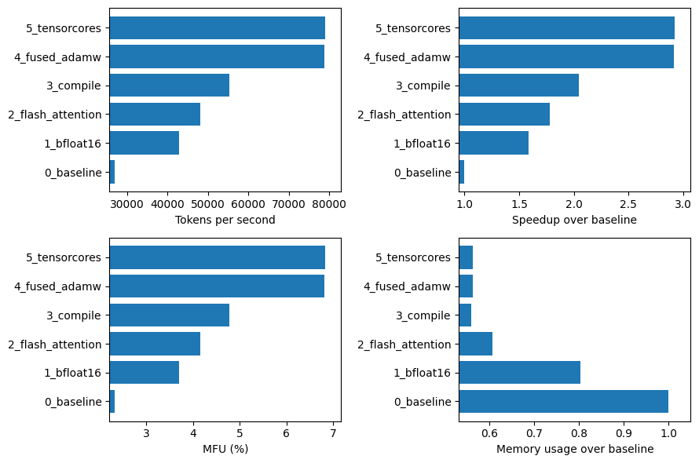

### 7.2 Tuning the batch size

So far all our testing and experiments have been done with a batch size of 1024 tokens, or more specifically a single sequence of 1024 tokens (i.e. the context size of GPT2). GPUs excel at parallel computation, and in general we can expect to see an improvement in throughput as the batch size (and thus the matrix multiplication size) increases up to some threshold or memory limit. So let's increase the batch size by doubling the number of sequences until we run out of memory.

Here are the results (noting the x-axis is log 2 scale):

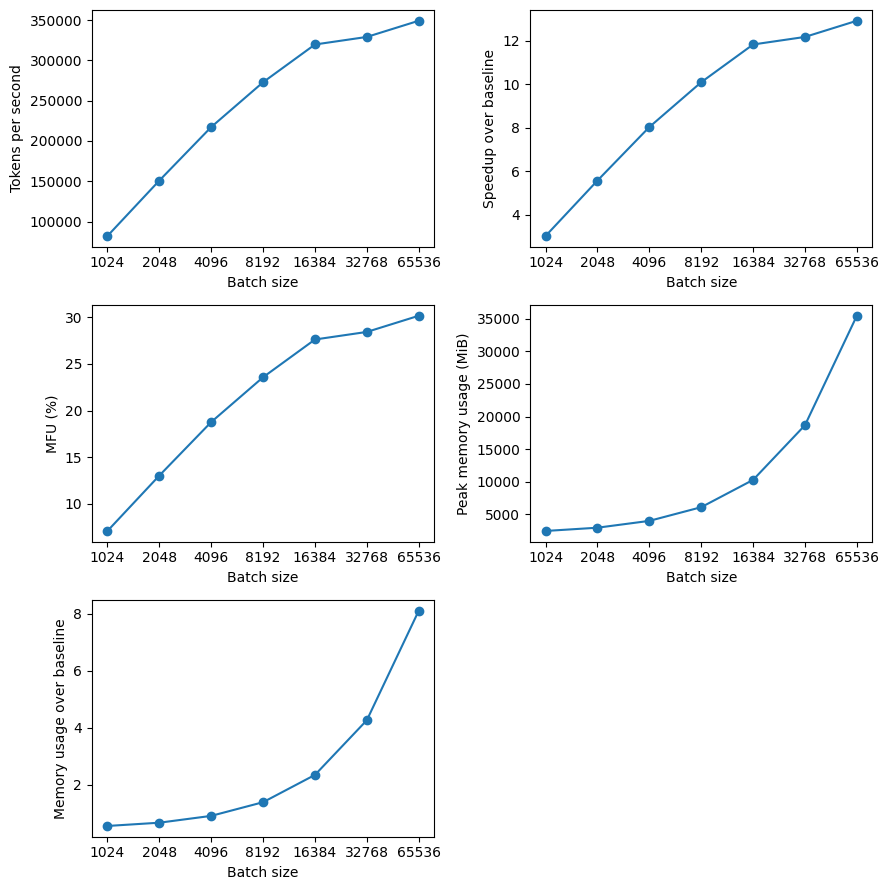

With my setup running on a single H100, I largest power of 2 batch size before the GPU ran out of memory was of 65K tokens (65 sequences of 1024 tokens). Interestingly, the peak memory usage was around 35 GiB for a batch size of 65K, which is much less than the 80 GiB limit of a H100. However, I don't think the 35 GiB accounts for some additional overhead usage, and we also see a more than linear increase in memory usage with batch size.  This can be explained by the $O(N^2)$ memory requirements of computing the attention scores, although I would need to investigate this further since flash attention generally mitigates some of this. I might also be able to squeeze more performance by testing batch sizes between 65K and 131K that are not powers of 2, but I wanted to keep things simple.

Importantly, we see a huge increase in throughput from increasing the batch size, hitting close to **350K TPS** for the largest batch size, which is around a 13X speedup over the base setup (no optimizations + batch size of 1024 tokens) on a H100. We also see that MFU has also improved to around 30% for the largest batch size. Though, my expectation was that this would be higher, so I'm left wondering if there is even more we can do to improve efficiency here.

## 8. Scoreboard after software optimizations

So to review, after applying algorithmic optimizations and tuning the batch size we were able to improve throughput when running on a H100 GPU from 27K TPS up to a much better 350K TPS. This is ~13X or 1 OOM speedup!. Compare this to where we started, running at a measly 645 TPS on my laptop CPU, so far we've managed a whopping 542X speedup, around $\log_{10}(542) = 2.73$ OOM!

| Setup                                 | TPS         | Speedup (X) |
| ------------------------------------- | ----------- | ----------- |
| Baseline (CPU, no optimizations)      | 645         | 1.0         |
| Hardware: MPS                         | 1149        | 1.78        |
| Hardware: CUDA on RTX 3090            | 11381       | 17.64       |
| Hardware: CUDA on H100                | 27026       | 41.90       |
| Software: bfloat16                    | 42871       | 66.47       |
| Software: flash attention             | 48154       | 74.66       |
| Software: torch compile               | 55271       | 85.69       |
| Software: fused adamw                 | 78750       | 122.09      |
| Software: tensorcores                 | 79013       | 122.50      |
| **Software: larger batch size (65K)** | **350,000** | **542.64**  |

So how does this look for training our 1.5B model? At 350K TPS it would take around 8 hours to train GPT2 124M on 10B tokens, or around 3.33 days to train a 1.5B param model (using our naive 1 OOM slowdown).

So with all these optimization we are looking at a reasonable training time for a small but non-trivial sized model. But so far we have still only been using a single GPU, while frontier model labs use clusters of thousands. So how much better can we do if we scale up to a full node of 8 H100's?

## 9. Getting parallel: DDP

Perhaps the simplest way to parallelize training of LLMs is through **Distributed Data Parallel** (DDP), where the model and optimizer is mirrored across multiple GPUs while each GPU processes a different slice of the current batch of data. This parallelization across the data dimension is why this strategy is referred to as **Data parallel**.

The high-level flow per training step of DDP is as follows. Starting from identical model and optimizer states across N GPUs:

1. Sample a batch of data and split equally across N processes
2. Run each process on their batch, to compute their local gradients
3. Synchronize the gradients across all GPU processes, so all processes have the same gradients
4. Perform gradient descent step on each process

In this post i'm not going to go into the details of implementing DDP as this would require a blog post by itself to do it justice. The main references I used were [Karpathy's llm.c](https://github.com/karpathy/llm.c/tree/master) and the [Pytorch DDP series](https://pytorch.org/tutorials/beginner/ddp_series_intro.html).

With that said, we can dive into the results of scaling up training to use 8 H100's on a single node for training GPT2 124M. Firstly,
let's look at the throughput and MFU as we scale the number of GPUs to 1, 2, 4, and 8.

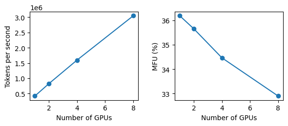

First thing to notice is we get linear speedup in the throughput which is exactly what we want! We also see a small, but significant drop in MFU (from 36% to 33%) as we scale the number of GPUs which is expected due to additional communication overhead introduced when running distributed training.

As a sanity check to make sure we are still getting the same model performance when scaling to multi-GPUs here is the training loss curves by step and by time across training runs with different number of GPUs. We see we get basically identical loss curves even when using different number of GPUs, which is what we should expect.

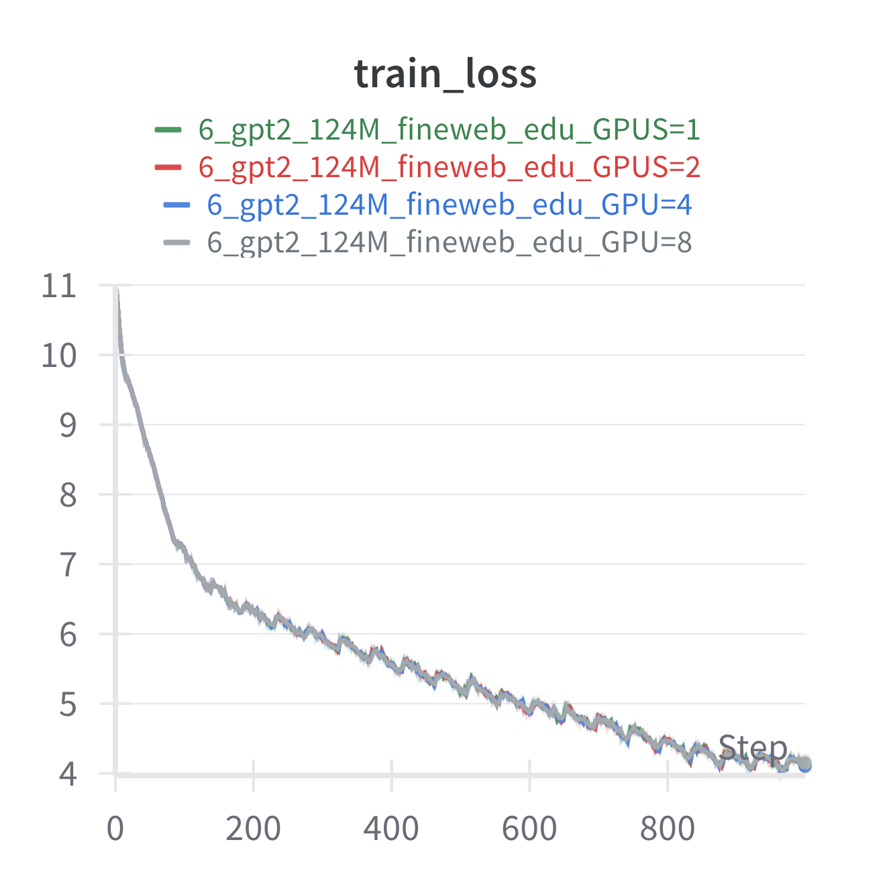 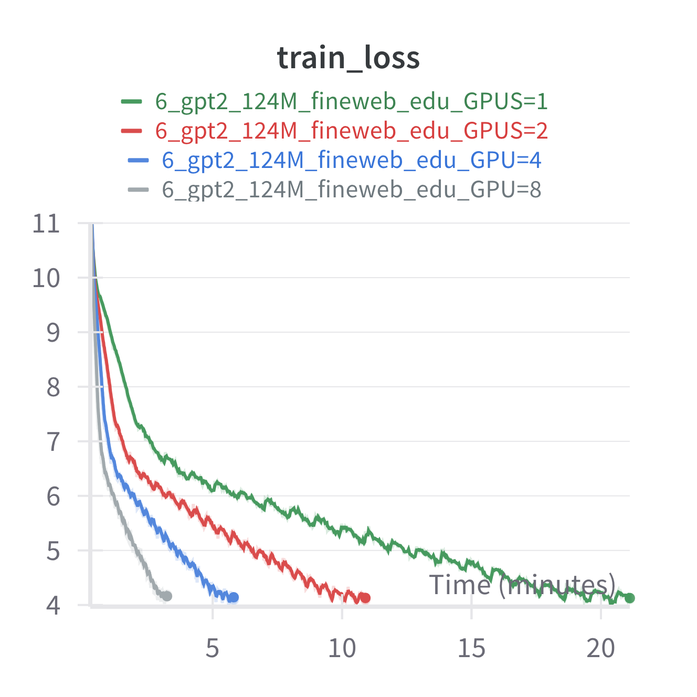

## 10. Scoreboard after Distributed Training

Reviewing our journey a little bit, we started with 645 TPS on my laptop CPU, and we are now at 3M TPS on a single node of 8 H100s. This is a 4,723x or $\log_{10}(4651) = 3.67$ OOM speedup and takes the time to train GPT2 124M on 10B tokens from 180 days down to 55 min!. Also recall that on a single GPU with all the optimizations it was going to take around 8 hours for the same training run, here we get a clean 8X speedup.

| Setup                             | TPS           | Speedup (X)  |
| --------------------------------- | ------------- | ------------ |
| Baseline (CPU, no optimizations)  | 645           | 1.0          |
| Hardware: MPS                     | 1149          | 1.78         |
| Hardware: CUDA on RTX 3090        | 11381         | 17.64        |
| Hardware: CUDA on H100            | 27026         | 41.90        |
| Software: bfloat16                | 42871         | 66.47        |
| Software: flash attention         | 48154         | 74.66        |
| Software: torch compile           | 55271         | 85.69        |
| Software: fused adamw             | 78750         | 122.09       |
| Software: tensorcores             | 79013         | 122.50       |
| Software: larger batch size (65K) | 350,000       | 542.64       |
| **Distributed: DDP on 8 H100's**  | **3,046,409** | **4,723.11** |

## 11. Training GPT2 124 M on 10B tokens

Ok now that we have spent all this time optimizing our training setup let's do a full training run of 10B tokens with GPT2 124M.

As per our earlier experiments we see a pretty consistent 3M TPS across the 10B tokens training set. The total training time was ~60 min, about 5 min more than predicted, though this run also includes periodic validation:

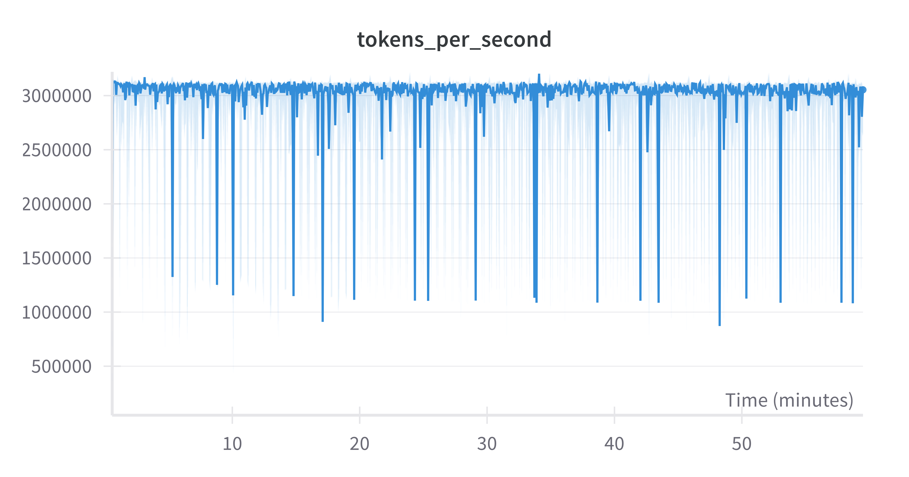

And here is a very satisfying learning curve:

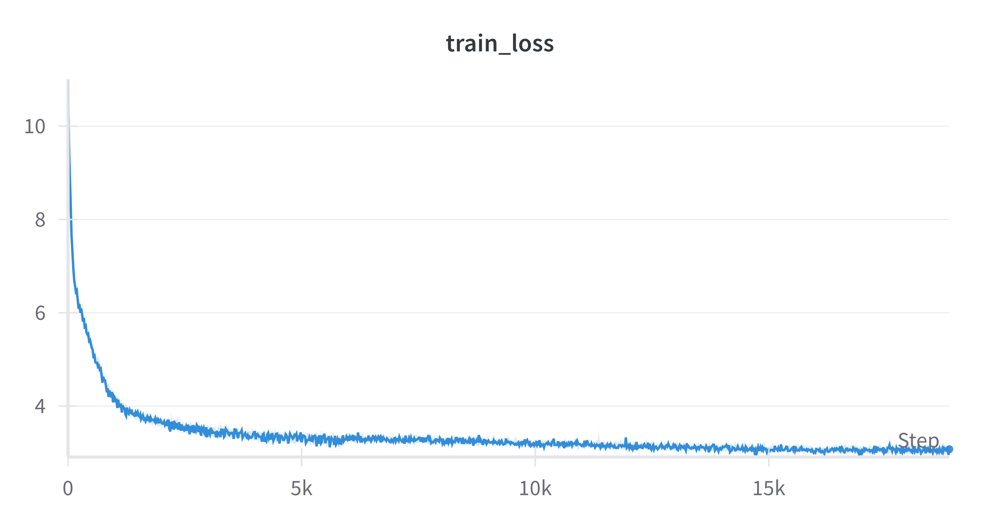

We observe a smooth drop in loss, which is very promising.

### 11.1 Hellaswag Benchmark

Testing our trained model on the hellaswag benchmark, we get comparable results Karpathy's llm.c. We can also see an appreciable increase from the same model trained on 10x less data on the tinystories dataset.

| Model                          | Training steps | acc    | acc_norm |
| ------------------------------ | -------------- | ------ | -------- |
| gpt2 124m tinystories 1B       | 1776           | 0.2669 | 0.2631   |
| gpt2 124m fineweb edu 10B      | 18865          | 0.2886 | 0.3007   |
| gpt2 124m llm.c 10B (reported) | 18865          | 0.2859 | 0.2955   |

Very validating :)

## 12. Scaling up to full size GPT2 model

Ok at this point we have successfully trained GPT2 124M on 10B tokens. The next step is to scale up to the full size model: GPT2 1.5B. Fortunately, since we are training on H100s which have 80GB of memory which can fit the full model with room to spare, switching to training GPT 1.5B is a simple as tweaking some hyperparameters and adjusting the batch size.

In my case I found I was able to use a batch size of 16 sequences of 1024 tokens, so total of around 16K tokens per GPU. The GPT2 paper uses a total batch size of around 1M tokens. This means that since we can handle a max of 16K tokens X 8 GPUs = 128K tokens per step, we need to use 8 gradient accumulation steps to hit the total batch size, which is no big deal.

So how did it go? Well here we have the training loss of the 1.5B compared to the 124M models trained on the same dataset. Recall that the batch size was 524K and 1M  for the 124M and 1.5B models, respectively, hence why there are twice as many training steps for the 124M model.

Learning curve vs 124 M (by step and time)
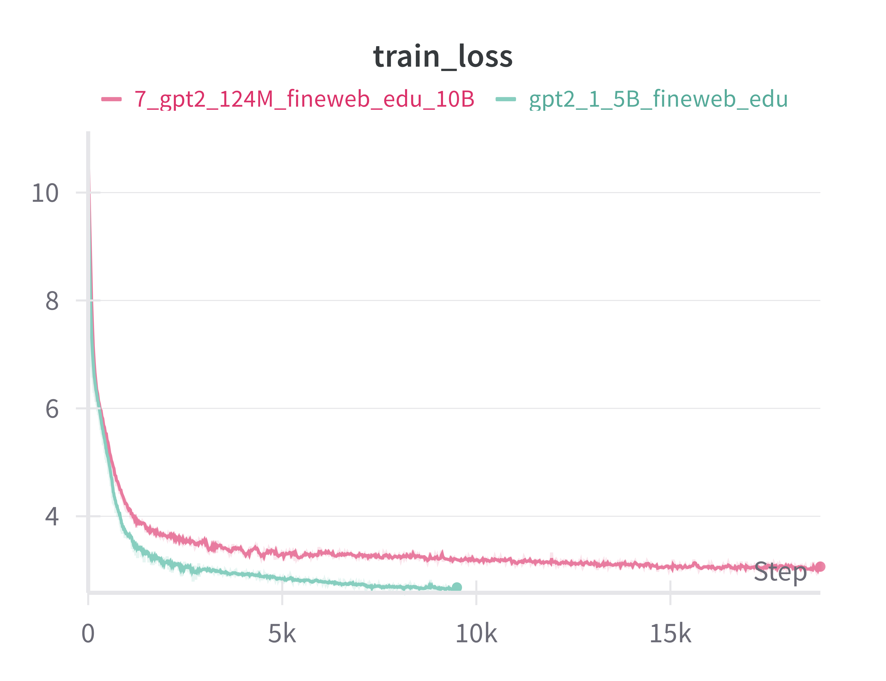

The first thing you'll probably notice is a significant drop in the final loss. We get a big boost in performance simply by scaling up the model size, keeping everything else the same. For me this gave me a visceral sense of the scaling laws in action.

Of course training with a larger model comes at a cost. With the 10X increase in model parameters we saw a roughly 10X drop in TPS, with around 320K TPS across the 8 H100s. Interestingly, this corresponds to around 41.94% MFU most likely due to the higher arithmetic intensity (i.e. bigger matrix multiplications) which comes with larger layers. Total training time was 582 min, which again is very close to 10X the time it took to train the 124M model (59.5 min).

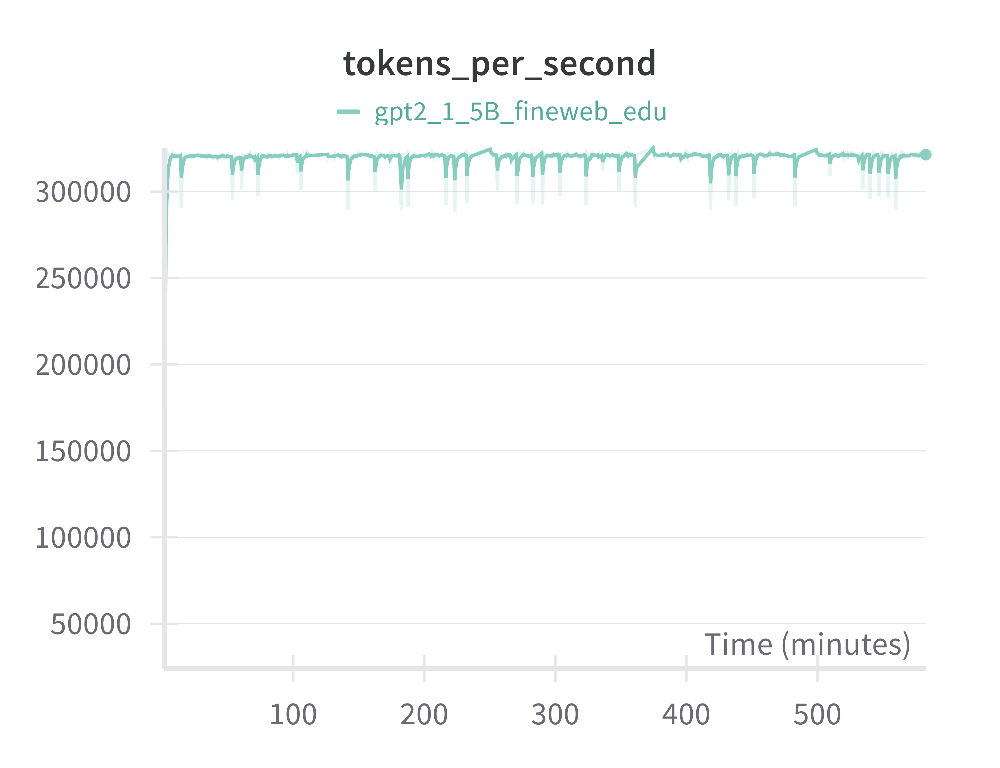

### 12.1 Evaluating GPT2 1.5B

So how was does final model compare?

Below are the results of running the hellaswag evaluation. There is a noticeable increase in accuracy of around 6% between GPT2 124M to GPT2 1.5B, which is very satisfying to see. It is worth noting though that these results are far from SOTA with the hellaswag benchmark being essentially solved by more modern models that get 95% or more.

| Model                          | Training steps | acc    | acc_norm |
| ------------------------------ | -------------- | ------ | -------- |
| gpt2 124m tinystories 1B       | 1776           | 0.2669 | 0.2631   |
| gpt2 124m fineweb edu 10B      | 18865          | 0.2886 | 0.3007   |
| gpt2 124m llm.c 10B (reported) | 18865          | 0.2859 | 0.2955   |
| gpt2 1.5B fineweb edu 10B      | 9500           | 0.3450 | 0.4122   |
| gpt2 1.5B llm.c 32B (reported) | 10042 ??       | 0.3842 | 0.4893   |

**Note**: gpt2 124M used batch size of 500K, while gpt2 1.5B used batch size of 1M.

**Note:** The `gpt2 1.5B llm.c` result I am assuming used 32B steps based on the train script in the `llm.c` directory which trains for 32K steps on the `fineweb edu 100B` dataset (at 1M tokens per step)

## 13. Summary

The goal of this project for me was to train a non-trivial size transformer, specifically GPT2 1.5B, from scratch. Prior to starting this project I would consider myself fairly familiar with deep learning, transformers, and LLMs, at least from an understanding point of view. However, I'd never properly trained anything that would be considered an LLM.

Overall I really enjoyed the challenge and it was fun seeing the numbers (TPS, MFU, accuracy) go up. Though perhaps beyond just the technical learnings, the biggest takeaway for me was the visceral sensation of how we can get intelligence by just taking the same thing and making it bigger, and how this has been largely driven by better hardware. It definitely gave me a deeper appreciation? perspective? on scaling as a path to intelligence.

As a final graph, here is a bit of summary of where we started and where we ended up in terms of increasing the speed at which we could train models. The rows of the graph are in order of the optimizations we applied, starting from training using my laptop CPU all the way up to training across 8 H100s using DDP:

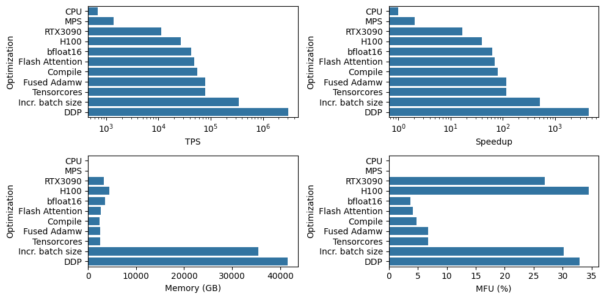

---

## Footnotes

[^1]: Here are my favorite tutorials and resources when it comes to implementing GPT2: [Karpathy's llm.c](https://github.com/karpathy/llm.c/tree/master), [nano gpt](https://github.com/karpathy/nanoGPT), and [youtube vid](https://www.youtube.com/watch?v=kCc8FmEb1nY). A lot of my implementation was heavily based on the python implementation in `llm.c` in particular, including the various software optimizations I tried. Neel Nanda's transformer tutorials [part 1](https://www.youtube.com/watch?v=bOYE6E8JrtU) [part2](https://www.youtube.com/watch?v=dsjUDacBw8o). A more mechanistic interpretability flavored implementation, but goes into more detail than Karpathy's tutorials.

[^2]: [PaLM paper](https://arxiv.org/abs/2204.02311)

[^3]: [DeepSpeedAI Megatron](https://github.com/deepspeedai/Megatron-DeepSpeed)

[^4]: [Llama 3 paper](https://ai.meta.com/research/publications/the-llama-3-herd-of-models/)
